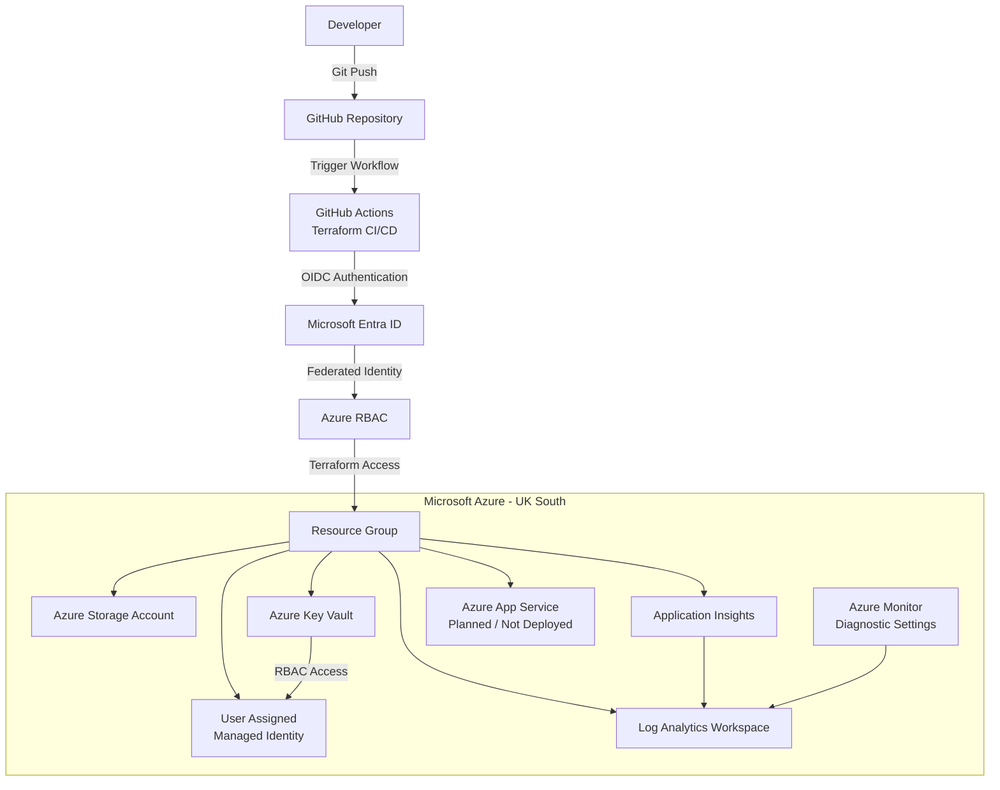

# Azure Web Platform Architecture

## Architecture Overview

The platform uses Terraform to define Azure infrastructure and GitHub Actions for automated validation and planning.

GitHub Actions authenticates to Microsoft Azure using OpenID Connect (OIDC), removing the requirement for long-lived Azure client secrets.

## CI/CD Flow

1. Infrastructure code is committed and pushed to GitHub.
2. GitHub Actions starts the Terraform CI/CD workflow.
3. GitHub authenticates to Microsoft Entra ID using OIDC.
4. Azure RBAC authorizes the federated identity.
5. Terraform initializes and validates the configuration.
6. Terraform generates an infrastructure plan.
7. Infrastructure changes remain reviewable before deployment.

## Security Design

The architecture uses:

- OpenID Connect (OIDC) federation
- Microsoft Entra ID
- Azure RBAC
- User Assigned Managed Identity
- Azure Key Vault
- HTTPS-only storage
- TLS 1.2 minimum
- No long-lived Azure client secret stored in GitHub

## Monitoring Design

Azure monitoring is provided through:

- Log Analytics Workspace
- Application Insights
- Azure Monitor Diagnostic Settings

These components provide centralized monitoring and diagnostic capabilities for the platform.

## App Service

Azure App Service was included in the intended architecture but was not deployed because of subscription/service availability constraints in the development environment.

It is therefore represented as a planned workload rather than an active deployed resource.